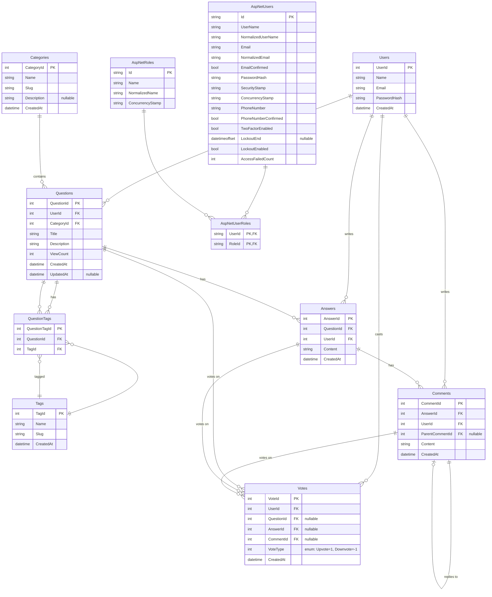

# Ostad.Forum – Database / Entity Diagram

## Entity Relationship Diagram (Mermaid)

## Table Summary

| Table           | Purpose |
|-----------------|---------|
| **Users**       | Forum user profile (display name, email); links to content. Identity is in AspNetUsers. |
| **Categories**  | Question categories (e.g. Technology). |
| **Tags**        | Tags for questions (many-to-many via QuestionTags). |
| **Questions**   | Main question post (title, description, view count). |
| **QuestionTags**| Many-to-many link between Questions and Tags. |
| **Answers**     | Answers to a question. |
| **Comments**    | Comments on an answer; optional ParentCommentId for nested replies. |
| **Votes**       | Up/down votes on a Question, Answer, or Comment (one of the three IDs set). |
| **AspNetUsers** | ASP.NET Identity – login, password, email. |
| **AspNetRoles** | Roles (e.g. Admin). |
| **AspNetUserRoles** | User–Role assignment. |

*(Other Identity tables: AspNetRoleClaims, AspNetUserClaims, AspNetUserLogins, AspNetUserTokens are part of the same database.)*

## Vote target

Each **Vote** row has exactly one of **QuestionId**, **AnswerId**, or **CommentId** set (the other two are null). Unique indexes enforce one vote per user per question, per user per answer, and per user per comment.
